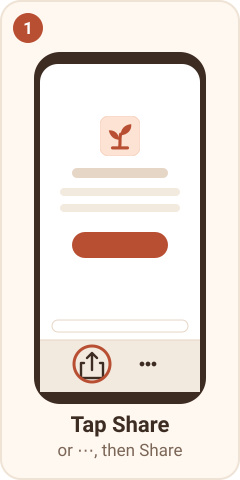
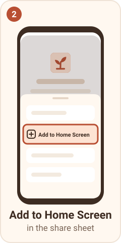
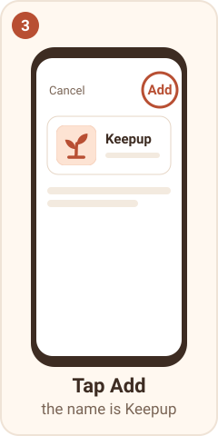
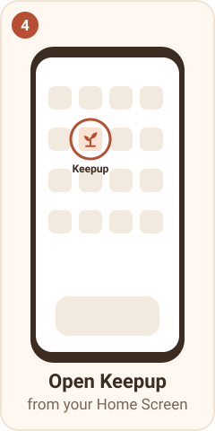
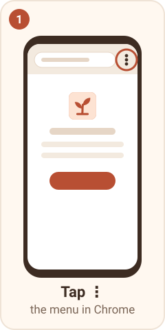
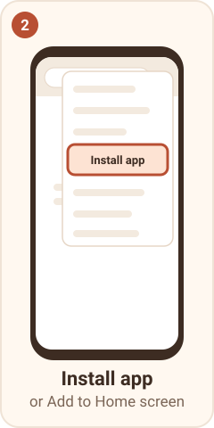
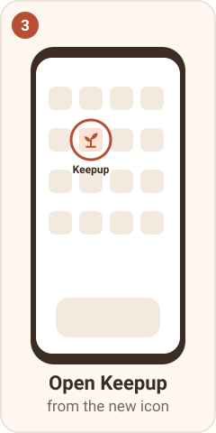
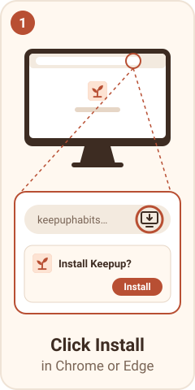

<p align="center"></p>

# Keepup

**Habits, together.** A warm, mobile-first habit tracker for one person, a family, and kids without a login.

**[Open Keepup](https://keepuphabits.vercel.app)**

[](https://github.com/naum-4ik/keepup/actions/workflows/ci.yml)  [](LICENSE)

<p align="center">
  
  
  
</p>

## How to install

Keepup is a web app you add to your Home Screen: it opens full screen and can send reminders. The same steps, in the app: **[keepuphabits.vercel.app/install](https://keepuphabits.vercel.app/install)**.

### iPhone and iPad (Safari)

Open Keepup in Safari, tap **Share** (or **⋯**, then Share), tap **Add to Home Screen**, then **Add**. Open Keepup from the new icon and sign in.

<p align="center">
  
  
  
  
</p>

### Android (Chrome)

Open Keepup in Chrome, tap **⋮**, then **Install app** (or Add to Home screen). Open Keepup from the new icon.

<p align="center">
  
  
  
</p>

### Computer (Chrome or Edge)

Click the install icon at the right of the address bar, then **Install**.

<p align="center">
  
</p>

Then turn reminders on: Profile → Settings → **Turn on reminders**. Reminders belong to one install, so after reinstalling, turn them on again in Settings. Installed Keepup from the old address (keepup-murex.vercel.app)? Install it again from the new one, then delete the old icon.

## What it does

Try the demo on the first screen, no sign-up: it opens a lived-in account (Sam's month, a family with Alex and a kid, Nova), deleted after 24 hours. Invites and push are off in the demo.

### Every day

- **Today:** a progress card (a ring of today's habits, what's left, and a small celebration when all are done), then a card per habit with one-tap check-in, progress (`3 / 8 today`, `1 of 3 this week`) and a streak badge. What's left comes first, then **Done for today**, then **Later** (habits that start later, or paused ones). Group and kid habits follow in their own sections.
- **Ready-made habits:** 48 templates, 6 in each of 8 categories (Health, Fitness, Mind, Learning, People, Home, Work & money, Break a habit), or your own with any emoji. Schedules are *X times a day, week or month*, from a start date you choose.
- **Habit page:** this period's check-ins with undo, current and best streak, history, pause and resume, an optional end ("Day 12 of 30", then keep going or finish), edit, archive or delete.
- **Fair streaks:** periods follow your time zone and week start (Sunday or Monday), a pause never breaks a streak, and a habit started mid-week doesn't count as missed.

<p align="center">
  
  
</p>

### Progress

- **Progress:** a "Your week" card (tap a day to see what you did), a month-by-month calendar back to your first habit, and active, finished and archived habits by category, each with its last 7 days. Finished habits can start again.
- **Recaps:** a weekly and a monthly recap of your wins in the Inbox, with their history under Progress → Recaps.

<p align="center">
  
  
</p>

### XP, levels, badges and rest days

- **XP and levels:** a check-in earns +10, and the first one of a period grows with your streak, up to +30. Finished periods and streak milestones add more. Levels go from Seedling to Forest, with a ring around your Profile avatar.
- **Badges and milestones:** 24 badges under Profile → Achievements. Streak milestones (1, 2, 5, 7 days… 365) arrive in the Inbox, once per streak. Level-ups and badges get a short full-screen moment, or a quiet toast (Settings → Celebrations).
- **Rest days:** a week of a daily habit earns one (up to 2); a missed day uses it and the streak stays safe.

<p align="center">
  
  
</p>

### Groups and kids

- **Groups** (family, friends, couple, roommates) with invite links and emoji avatars.
- **Habits done together:** a period is done when everyone required has checked in, with optional approval by another adult, cheers and nudges.
- **Kids without a login:** an adult checks in for them, or they tap in a kid view. Each approved check-in is a star, and the week's stars grow a garden (or an aquarium, space, a dino egg or a town) toward a treat goal chosen with the child.
- **Inbox:** activity, nudges and cheers, updating live.

### On your phone

- **Installable app:** opens full screen from the Home Screen, no app store.
- **Reminders and pushes:** a daily summary at your hour or a habit's own time; group check-ins, approvals, nudges and kids' moments; per kind Sound, Silent or Inbox only; pause all, or mute a habit.
- **Offline:** check in without signal. The tap is saved on the phone and counts for the day you tapped once you're back online. The last Today and kid view open offline.

<p align="center">
  
  
</p>

### Your data

- **Settings:** Export my data (a JSON file), Reset my data (type "reset"), and Delete account (type "delete"; it says first which groups get a new admin and which are deleted).
- **Forgot password?** on the sign-in screen emails a reset link.
- **Private by design:** no ads and no advertising services; a child is a nickname, an emoji and a colour, with no photos or birthdates. Details: [privacy policy](https://keepuphabits.vercel.app/privacy).

## How it's built

Next.js 16 (App Router, Server Actions) on Vercel talks to Supabase: Postgres with row-level security, Auth (Google and email + password), Realtime for the live Inbox, `pg_cron` for periods, reminders, recaps and demo cleanup, and an Edge Function that sends Web Push. The phone runs a service worker and an offline queue. GitHub Actions runs CI, deploys and keeps encrypted backups; traces go to Grafana Cloud.

Diagrams, security layers, free-tier limits and the scaling path: [docs/architecture.md](docs/architecture.md). Colours, type, motion and voice: [docs/design.md](docs/design.md). The reasons behind the big choices: [docs/decisions](docs/decisions/README.md) (27 records).

## Engineering highlights

**The database is the security boundary.** Row-level security on every table (a pgTAP test fails if a table lacks it), column-level grants, and `SECURITY DEFINER` RPCs for the rules. A child is a `profiles` row with no `auth.users` entry, so adults act for them through one function, `can_act_for_profile`, that RLS and the RPCs share. Nobody can read another person's `profiles` row; names and avatars reach the screens only through functions that check group membership first. The one function callable without signing in is the invite preview, and a test fails if there is a second.

**Who is required this period?** Periods and streaks are decided in SQL, across time zones, daylight-saving changes and each person's week start. A group habit is done when everyone required has checked in: an adult counts if they were a member from the start of the period, a member pause excuses them, and with approval on, a pending check-in can be reviewed until period end plus 12 hours, so the period stays open and a streak never flickers. All of it lives in one function, `period_outcome`, covered by pgTAP.

**Offline taps count the tap day.** Every tap gets a client-made id, so a resend after a lost response can't count twice. A queued tap carries the phone's time, and the server uses `least(tap, arrival)` for the day, accepted up to 3 days late, so a fast clock can't push a tap into tomorrow. Even online taps go queue-first ([`lib/offline-queue.ts`](lib/offline-queue.ts), [`offline-sync.ts`](lib/offline-sync.ts)). The database stays the only judge of what counts.

**Push decided in the database.** Pushes start from many places: a check-in, an approval, a pause, a cron job. A trigger on the feed table sets each row's category and `push` from the person's preferences (Pause all and mutes always win), then `pg_net` calls an Edge Function that sends one push per device. Each push carries a tag, so a newer one replaces the older, and on the last check-in of a group habit the superseded push is skipped: the family's phones buzz once, not four times.

**An XP ledger a late check-in can't fool.** XP is an append-only table with one unique key per grant, so every grant is idempotent and an undo is a negative row. Period XP, streak milestones and badges hang off a trigger that fires when a period is settled, and again when an offline check-in upgrades it from missed to done up to three days later. Milestones are keyed by the streak's first day, so they are never paid twice, and rest days come from the same results, so the upgrade hands back a used rest day by itself.

**Delete account in one transaction.** `delete_my_account()` hands over admin to the longest-standing member, deletes groups left empty (with their children), then deletes the caller from `auth.users` and lets cascades take the rest, with no service-role key in the app. Locks are taken in the same order the feed and XP writes use, so they can't deadlock, and a read-only preview runs the same plan, so the dialog says exactly what will happen ([decision 0025](docs/decisions/0025-delete-account-is-one-database-transaction.md)).

**A demo that is a database seed.** "Try the demo" signs in anonymously and seeds 30 days of a lived-in account in one transaction; demo and real accounts can't mix (database guards), and an hourly job deletes demos after 24 hours ([decision 0026](docs/decisions/0026-the-demo-is-a-database-seed.md)).

**Tests at every layer:** 1257 pgTAP tests in 51 files, 1668 Vitest and 200 Playwright tests (phone viewport), plus the Edge Function tests under Deno in CI. Counts from [`scripts/count-tests.mjs`](scripts/count-tests.mjs).

## Environments

| Environment | Address | Deploys |
|---|---|---|
| Production | [keepuphabits.vercel.app](https://keepuphabits.vercel.app) | Vercel project `keepup-prod`, Supabase production. Only on a release (merge to `main`): database migrations, then the push function, then the app. A failed step stops the rest |
| Staging | [keepup-stage.vercel.app](https://keepup-stage.vercel.app) | Vercel project `keepup-stage`, Supabase staging. Every merge to `develop`; migrations go out after CI's database tests pass |
| PR previews | a Vercel preview link per PR | The app only, on staging data |

- **Flow:** `feature/*` → PR → `develop` (staging) → release PR → `main` (production). `main` is the default branch; release-please writes the versions and the changelog.
- **CI:** every PR that changes code runs lint, types, unit and Edge Function tests in about a minute; each merge runs pgTAP (it gates the staging database deploy) and the full Playwright suite after it ([decision 0024](docs/decisions/0024-pr-checks-in-a-minute.md)).
- **Backups:** staging and production are dumped nightly (schema, data and logins), encrypted with `age`, and a monthly job restores the latest into a throwaway database and checks it.

## Observability

The server sends OpenTelemetry traces and events (one wide event per action, linked to its trace) straight to Grafana Cloud's free tier, with no collector; when switched on, the browser sends its errors and speed measurements through Grafana Faro. Passwords, tokens and keys are masked before export, and a unit test fails if one gets through. What is sent, the queries, and a real incident with its lessons: [docs/observability](docs/observability/README.md).

## Run locally

Requires Node 24+ and Docker.

```bash
git clone https://github.com/naum-4ik/keepup && cd keepup
npm install
npx supabase start          # local Postgres, Auth, Studio (:54323), Mailpit (:54324)
node scripts/local-env.mjs  # writes .env.local
npm run dev                 # http://localhost:3000
```

Tests: `npm test` (Vitest) · `npx supabase test db` (pgTAP) · `npm run e2e` (Playwright) · `npm run test:functions` (Deno) · counts: `node scripts/count-tests.mjs`

README screenshots: `npm run readme:screenshots` (local stack; seeds a demo month, macOS `sips` resizes).

## Roadmap

| Milestone | What | Status |
|---|---|---|
| M1 | Foundation: auth (Google, email and password), profiles, CI, staging deploys, versioning | ✅ v0.2.0 |
| M2 | Private habits: templates, check-ins, streaks, pauses, habit page, progress, weekly overview, onboarding | ✅ v0.3.0 |
| M3 | Groups and family: shared habits, approvals, kid profiles with a star garden, emoji avatars, backups | ✅ v0.4.0 |
| M4 | Installable app (PWA), push reminders, offline check-ins | ✅ v0.5.0 |
| M5 | XP, levels, badges, rest days, weekly recaps | ✅ v0.6.0 |
| M6 | Landing page, "Try the demo", privacy policy, data export and account delete, production | ✅ v1.0.0 |

Next: ideas for after v1.

## How it was built

Built with Claude Code as a pair programmer. I wrote the spec, made the product and architecture decisions, and reviewed and merged every feature PR; tests and CI gate every code change.

License: [MIT](LICENSE).
