<p align="center"></p>

# Keepup

**Habits, together.** A warm, mobile-first habit tracker for one person, a family, and kids without a login.

**[Open Keepup](https://keepuphabits.vercel.app)** · **[Try the demo, no sign-up](https://keepuphabits.vercel.app)** (tap **Try the demo** on the first screen; the demo account and its data are deleted after 24 hours)

[](https://github.com/naum-4ik/keepup/actions/workflows/ci.yml)  [](LICENSE)

**Status:** v0.6.1, heading to v1.0.0. The link above is the staging build, deployed from `develop`.

<p align="center">
  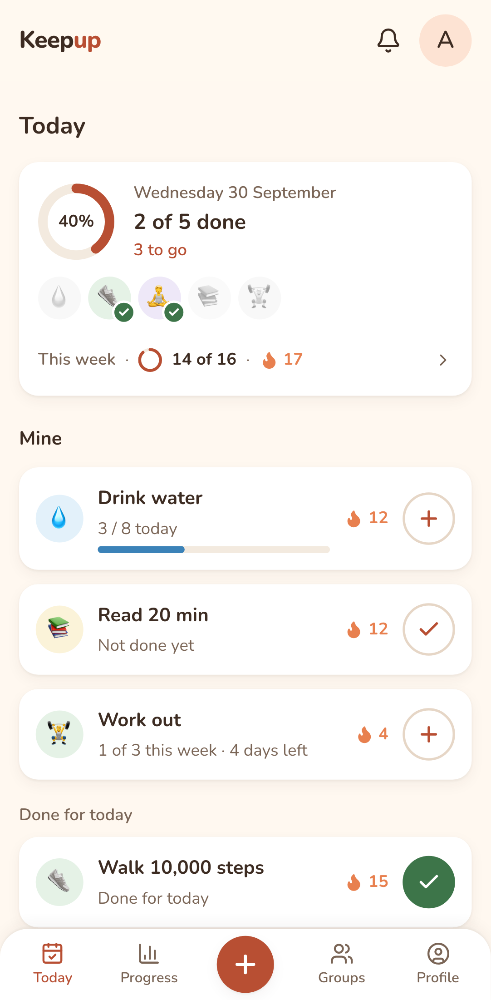
  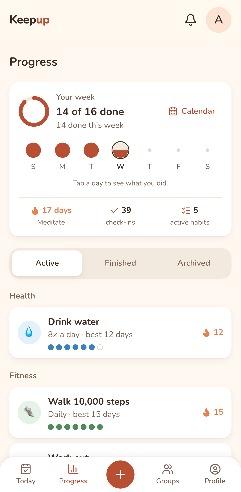
  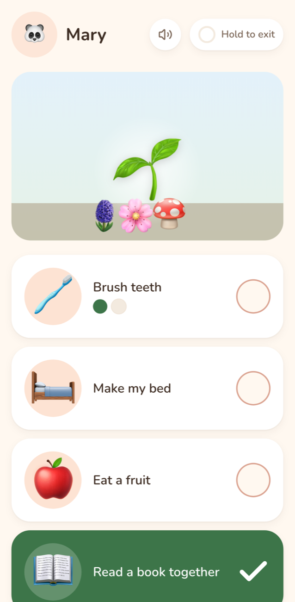
</p>

## How to install

Keepup is a web app you add to your Home Screen: it opens full screen and can send reminders. Step by step: **[keepuphabits.vercel.app/install](https://keepuphabits.vercel.app/install)**.

- **iPhone / iPad:** open Keepup in Safari → Share → **Add to Home Screen** → open the new icon and sign in.
- **Android:** open Keepup in Chrome → ⋮ → **Install app** (or Add to Home screen).
- **Computer:** in Chrome or Edge, click the install icon at the right of the address bar.

Then turn reminders on: Profile → Settings → **Turn on reminders**. Reminders belong to one install, so turn them on again after reinstalling. Installed Keepup from the old address (keepup-murex.vercel.app)? Install it again from the new one, then delete the old icon.

## What it does

- **Your habits:** 48 ready-made templates or your own, one-tap check-ins, and streaks that are fair to pauses, time zones and your week start.
- **Together:** group habits that are done when everyone required has checked in, with optional approval, cheers and nudges.
- **Kids:** a parent checks in for them, or they tap in a kid view; stars grow a weekly garden toward a treat.
- **Private by design:** no ads and no analytics or advertising services; a child is a nickname, an emoji and a colour, with no photos or birthdates; export or delete your data from Settings. Details: [privacy policy](docs/privacy-policy.md).

## Engineering highlights

- **The database is the security boundary:** row-level security on every table (a pgTAP test fails if a table lacks it), column-level grants, and `SECURITY DEFINER` RPCs for the rules. **1252 pgTAP tests** in 51 files.
- **Correct periods and streaks** across time zones, daylight-saving changes and each person's week start, decided in SQL.
- **Offline check-ins:** an IndexedDB queue on the phone ([`lib/offline-queue.ts`](lib/offline-queue.ts), [`offline-queue-store.ts`](lib/offline-queue-store.ts), [`offline-sync.ts`](lib/offline-sync.ts)) with client-made ids, so a resend never counts twice; the tap time counts, up to 3 days late.
- **Web push without an app store:** an installable PWA with a service worker, iPhone included; the database decides who gets a push and how (Sound, Silent or Inbox only per kind).
- **XP that can't drift:** an append-only XP ledger, levels, 24 badges, weekly and monthly recaps, and rest days, all computed in Postgres and safe against late offline check-ins.
- **A demo that is a database seed:** "Try the demo" signs in anonymously and seeds 30 days of a lived-in account in one transaction; demo and real accounts can't mix (database guards), and an hourly job deletes demos after 24 hours ([decision 0026](docs/decisions/0026-the-demo-is-a-database-seed.md)).
- **Your data, all or nothing:** Export my data downloads a JSON file; Delete account is one database transaction that hands over group admin, deletes groups left empty, and removes the login, with no service-role key in the app ([decision 0025](docs/decisions/0025-delete-account-is-one-database-transaction.md)). Password reset links carry a `token_hash` checked on the server, so they work on any device, not only in the browser that asked.
- **Tracing with redaction:** OpenTelemetry traces and events go to Grafana Cloud; passwords, tokens and keys are masked before export, and a unit test fails if one gets through ([docs/observability](docs/observability/README.md)).
- **Shipped like a team product:** `feature/*` → PR → `develop` (staging) → release PR → `main`; CI-gated PRs, release-please versions, encrypted nightly backups with a monthly restore test. The production deploy (database migrations first, then the app) and production backups are wired up and switch on when production exists.
- **Tests at every layer:** 1252 pgTAP, 1638 Vitest and 191 Playwright tests (phone viewport), plus the Edge Function tests under Deno in CI. Counts from [`scripts/count-tests.mjs`](scripts/count-tests.mjs).

## What works today

### Every day

- **Today:** a progress card (a ring of today's habits, what's left, and a small celebration when all are done), then a card per habit with its emoji, one-tap check-in, progress (e.g. `3 / 8 today`, `1 of 3 this week`) and a streak badge. It lists what's left to do first, then **Done for today**, then **Later** (habits that start later, or paused ones). Group and kid habits follow in their own sections.
- **Ready-made habits:** 48 templates, 6 in each of 8 categories (Health, Fitness, Mind, Learning, People, Home, Work & money, Break a habit), or create your own with any emoji. Schedules are *X times a day, week or month*. Choose a start date (today, tomorrow, next week, or any day on the calendar).
- **Habit page:**
  - this period's check-ins, with undo;
  - current and best streak, and history;
  - pause (with an optional return date) and resume;
  - an optional end (30 days, 8 weeks, a date…), shown as "Day 12 of 30"; at the end, keep going or finish it;
  - edit the habit; delete it (only if it has no check-ins) or archive it (keeps its history).
- **Onboarding:** name, detected time zone and week start, then pick up to 3 habits to start with.
- **Fair streaks:**
  - Periods follow your time zone and your week start (Sunday or Monday).
  - A pause never breaks a streak.
  - A habit started mid-week doesn't count as missed.

<p align="center">
  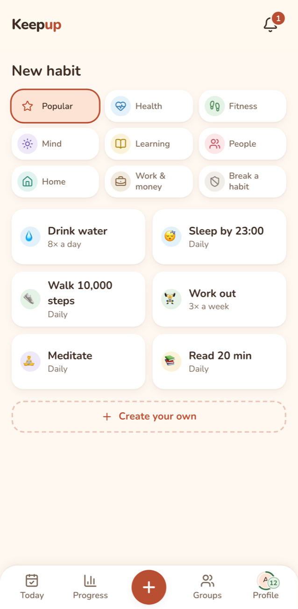
  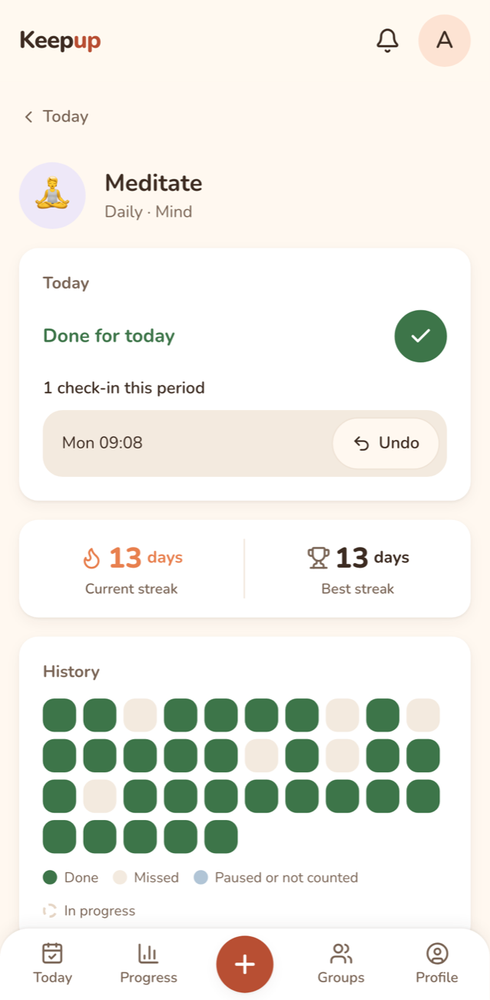
</p>

### Progress

- **Progress:** a "Your week" card (tap a day to see what you did), a month-by-month **calendar** back to your first habit, and active, finished and archived habits by category, each with its last 7 days as dots. Finished habits can start again.
- **Recaps:** a weekly and a monthly recap of your wins in the Inbox, and their history under Progress → Recaps.

<p align="center">
  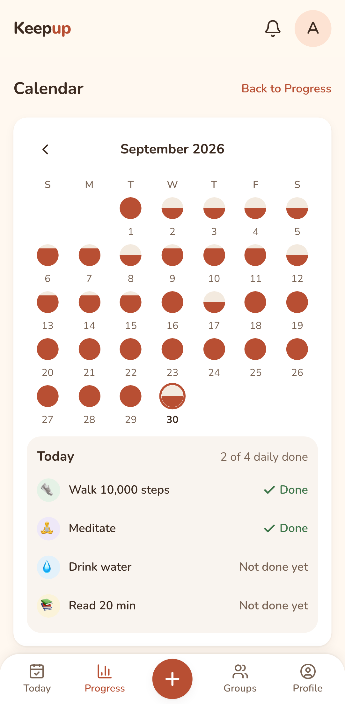
  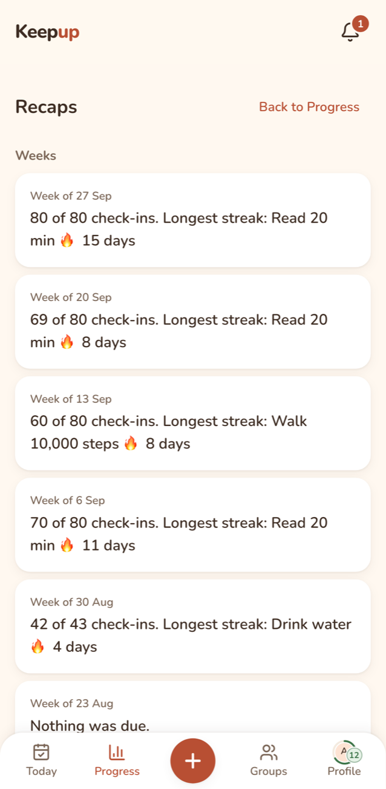
</p>

### XP, levels and badges

- **XP and levels:** every counted check-in earns XP (+10; the first of the day, week or month grows with your streak, up to +30), finished periods and streak milestones add more, and levels grow from Seedling to Forest. A ring around your Profile avatar fills towards the next level; Profile shows "Level 7 · Sprout" with a bar.
- **Badges and milestones:** 24 badges under Profile → Achievements (no tiers): earned in colour with the date, locked ones with a hint. Streak milestones (1, 2, 5, 7 days… 365) arrive in the Inbox, once per streak, "Back to 30" after a break. Level-ups and badges get a short full-screen moment, or a quiet toast (Settings → Celebrations).
- **Rest days:** a week of a daily habit earns one (up to 2); a missed day uses it automatically and the streak stays safe.

<p align="center">
  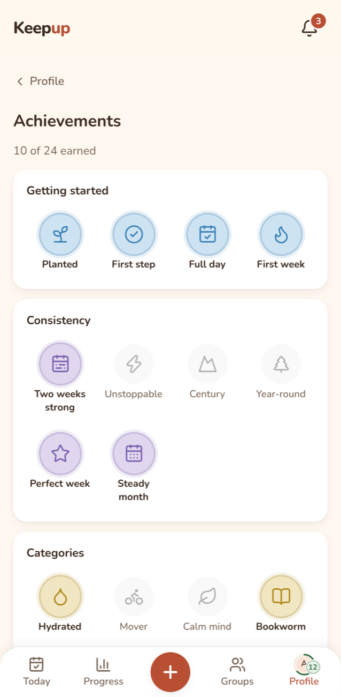
  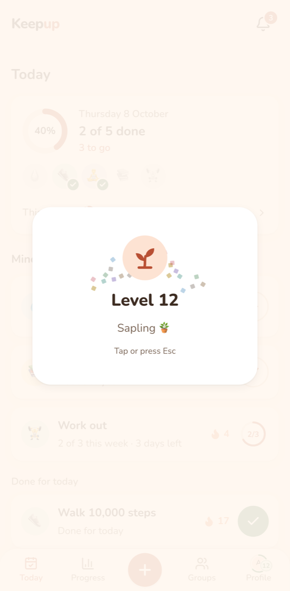
</p>

### Groups and kids

- groups (family, friends, couple, roommates) with invite links and emoji avatars;
- habits done together: a period is done when everyone required has checked in, with optional approval by another adult;
- kids without a login: an adult checks in for them, or they tap in a kid view (open habits first, done ones sink; the picture stays in sight while scrolling and moves gently, and every tap grows the scene); each approved check-in is a star, and the week's stars grow a garden (or an aquarium, space, a dino egg or a town);
- treat goals chosen with the child ("20 ⭐ for a trip to the zoo"), and a reset that keeps only the nickname and avatar;
- an Inbox for activity, nudges and cheers, updating live.

### On your phone

- **Installable app:** add it to the Home Screen; it opens full screen.
- **Reminders and pushes:**
  - a daily summary at your hour, or a habit's own time ("Remind me at…", on the quarter hour);
  - group check-ins, approvals, nudges and kids' moments can reach your phone;
  - per kind: Sound, Silent or Inbox only (Silent by default; Achievements: Inbox only);
  - pause all, and mute a habit.
- **Offline:** check in without signal. It's saved on the phone and counts for the day you tapped once you're back online. The last Today and kid view open offline.

<p align="center">
  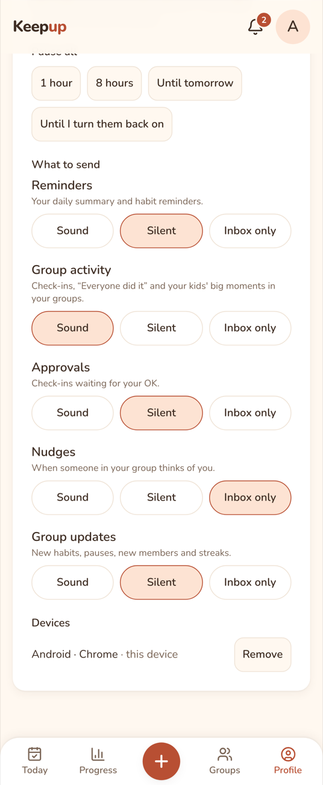
  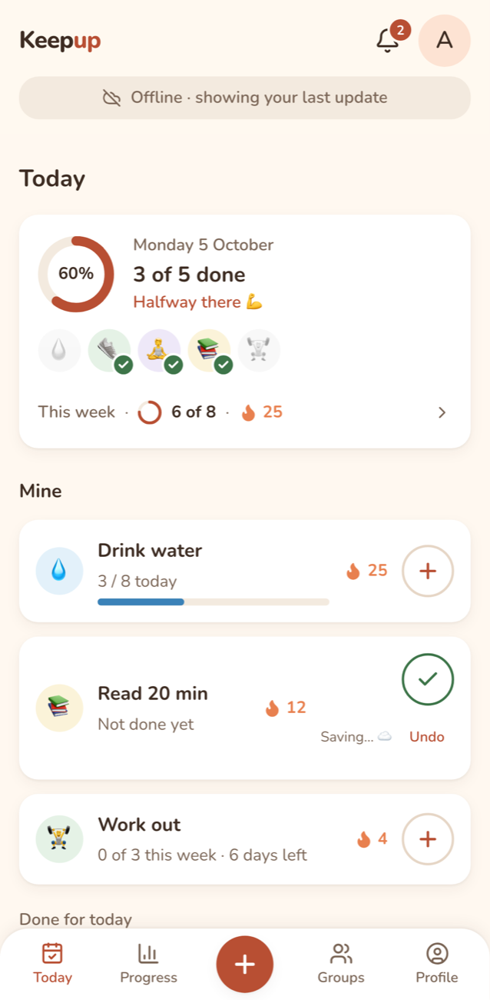
</p>


### Your data and the demo

- **Try the demo:** one tap on the first screen opens a lived-in account (Sam's month, a family with Alex and a kid, Nova); invites and push are off in the demo.
- **Settings:** Export my data (a JSON file), Reset my data (type "reset"), and Delete account (type "delete"; it says first which groups get a new admin and which are deleted).
- **Forgot password?** on the sign-in screen emails a reset link.
- **Privacy:** a [privacy policy](docs/privacy-policy.md), also in the app at `/privacy`.

## Interesting problems

**Who is required this period?** A group habit is done when everyone required has checked in, so "required" has to be exact. An adult counts if they were a member from the start of the period (or from the habit's creation, in its first period). A member pause that touches the period excuses them, but a period that everyone required finished is still `done`. With approval on, a period can't be finalized at its end: a pending check-in can be reviewed until period end plus 12 hours in the group's time zone, and until then the period shows as open, so a streak never flickers. All of it lives in one SQL function, `period_outcome`, covered by pgTAP.

**Kids without accounts under RLS.** A child is a `profiles` row with no `auth.users` entry, so `auth.uid()` can never be the child. Adults act for them through one function, `can_act_for_profile`, that RLS and the RPCs share. Nobody can read another person's `profiles` row (it holds time zone and reminder hour), so names and avatars reach the screens only through `SECURITY DEFINER` functions that check group membership first. The one function callable without signing in is the invite preview, and a test fails if there is a second.

**Push decided in the database.** Pushes start from many places: a check-in, an approval, a pause, a cron job. So the decision isn't in app code. A trigger on the feed table sets each row's category and `push` from the person's preferences (Pause all and mutes always win), then `pg_net` calls an Edge Function that sends one push per device. A missing secret only logs a warning and never blocks the action. Each push carries a tag, so a newer one replaces the older, and on the last check-in of a group habit the superseded push is skipped: the family buzzes once, not four times.

**Offline taps count the tap day.** Every tap gets a client-made id, so a resend after a lost response can't count twice. A queued tap carries the phone's time, and the server uses `least(tap, arrival)` for the day, accepted from 3 days back, so a fast clock can't push a tap into tomorrow. Even online taps go queue-first: saved on the phone, then sent, and removed only once the server answers. The database stays the only judge of what counts.

**An XP ledger a late check-in can't fool.** XP is an append-only table with one unique key per grant, written by one function, so every grant is idempotent and an undo is a negative row. Period XP, streak milestones and badges hang off a trigger that fires when a period is settled and again when an offline check-in upgrades it from missed to done up to three days later. Milestones are keyed by the streak's first day, so a merged streak can earn its 14-day bonus on a later day, but never twice. Rest days are computed from the same results, so the upgrade hands back a used rest day by itself. Levels are synced once at the end of any path that touches many habits, in a fixed order, so finalization can't deadlock.


**Delete account in one transaction.** Deleting a person touches their habits, their groups, the groups' children and the other members. Supabase's usual route, the admin API, runs after the database changes and needs the service-role key in the app, so a failure can leave a login with no profile or a group with no admin. `delete_my_account()` does all of it in one transaction: hand over admin to the longest-standing member, delete groups left empty (with their children), then delete the caller from `auth.users` and let cascades take the rest. Locks are taken in the order the feed and XP writes already use (habits, then groups, each by id), so they can't deadlock, and the groups are locked before anything is counted, so two last admins deleting at once run one after the other. A read-only preview runs the same plan, so the dialog says exactly what will happen.

## Architecture

Next.js 16 (App Router, Server Actions) on Vercel talks to Supabase: Postgres with row-level security, Auth (Google and email + password), Realtime for the live Inbox, `pg_cron` for periods, reminders, recaps and demo cleanup, and an Edge Function that sends Web Push. The phone runs a service worker and an offline queue. GitHub Actions runs CI, deploys migrations and keeps encrypted backups; traces go to Grafana Cloud. Diagrams, security layers, free-tier limits and the scaling path: [docs/architecture.md](docs/architecture.md). Colours, type, motion and voice: [docs/design.md](docs/design.md).

## How it was built

Built with Claude Code as a pair programmer. I wrote the spec, made the product and architecture decisions, and reviewed and merged every feature PR; tests and CI gate every code change. The reasons behind the big choices are in [docs/decisions](docs/decisions/README.md) (27 records so far).

- **Flow:** `feature/*` → PR → `develop` (staging) → release PR → `main` (production), versions and changelog by release-please.
- **CI:** every PR that changes code runs lint, types, unit and Edge Function tests in about a minute; each merge to `develop` runs pgTAP (it gates the staging database deploy) and the full Playwright suite ([decision 0024](docs/decisions/0024-pr-checks-in-a-minute.md)).

## Roadmap

| Milestone | What | Status |
|---|---|---|
| M1 | Foundation: auth (Google, email and password), profiles, CI, staging deploys, versioning | ✅ v0.2.0 |
| M2 | Private habits: templates, check-ins, streaks, pauses, habit page, progress, weekly overview, onboarding | ✅ v0.3.0 |
| M3 | Groups and family: shared habits, approvals, kid profiles with a star garden, emoji avatars, backups | ✅ v0.4.0 |
| M4 | Installable app (PWA), push reminders, offline check-ins | ✅ v0.5.0 |
| M5 | XP, levels, badges, rest days, weekly recaps | ✅ v0.6.0 (v0.6.1 fixes) |
| M6 | Landing page, "Try the demo", privacy page, data export and account delete, production → **v1.0.0** | ✅ v1.0.0 |

## Run locally

Requires Node 24+ and Docker.

```bash
git clone https://github.com/naum-4ik/keepup && cd keepup
npm install
npx supabase start          # local Postgres, Auth, Studio (:54323), Mailpit (:54324)
node scripts/local-env.mjs  # writes .env.local
npm run dev                 # http://localhost:3000
```

Tests: `npm test` (Vitest) · `npx supabase test db` (pgTAP) · `npm run e2e` (Playwright) · `npm run test:functions` (Deno) · counts: `node scripts/count-tests.mjs`

README screenshots: `npm run readme:screenshots` (local stack; seeds a demo month, macOS `sips` resizes).

License: [MIT](LICENSE).
