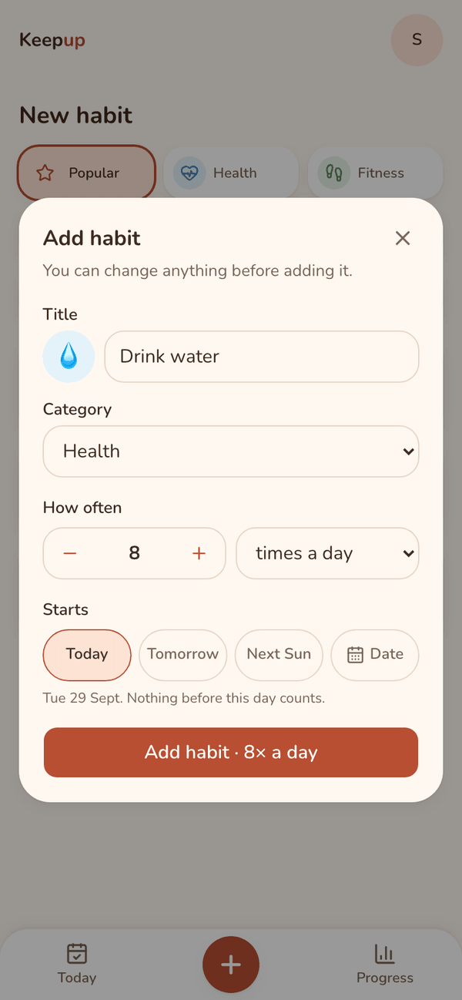

# Keepup

**Habits, together.**

[](https://github.com/naum-4ik/keepup/actions/workflows/ci.yml)

A warm, mobile-first habit tracker for one person and for families. Pick a habit, check in with one tap, and watch your streaks grow. Next up: shared family habits and kid profiles.

**Status:** in development (v0.x). Try the staging build at **https://keepup-murex.vercel.app**. Sign-in is limited to test users for now.

<p align="center">
  
  
  
</p>

## What works today

- **Today:** a "This week" strip (done so far, best streak), then a card per habit with its emoji, one-tap check-in, progress (e.g. `3 / 8 today`, `1 of 3 this week`) and a streak badge. It lists what's left to do first, then **Done**, then **Later** (habits that start later, or paused ones).
- **Ready-made habits:** 48 templates, 6 in each of 8 categories (Health, Fitness, Mind, Learning, People, Home, Work & money, Break a habit), or create your own with any emoji. Schedules are *X times a day, week or month*. Choose a start date (today, tomorrow, next week, or any day on the calendar).
- **Habit page:**
  - this period's check-ins, with undo;
  - current and best streak, and history;
  - pause (with an optional end date) and resume;
  - edit the habit; delete it (only if it has no check-ins) or archive it (keeps its history).
- **Progress:** a "Your week" card (days, streaks, check-ins), and active and archived habits by category, each with its last 7 days as dots.
- **Onboarding:** name, detected time zone and week start, then pick up to 3 habits to start with.
- **Fair streaks:**
  - Periods follow your time zone and your week start (Sunday or Monday).
  - A pause never breaks a streak.
  - A habit started mid-week doesn't count as missed.

<p align="center">
  
  
</p>

## Roadmap

| Milestone | What | Status |
|---|---|---|
| M1 | Foundation: auth (Google, magic link), profiles, CI, staging deploys, versioning | ✅ v0.2.0 |
| M2 | Private habits: templates, check-ins, streaks, pauses, habit page, progress, weekly overview, onboarding | ✅ v0.3.0 |
| M3 | Groups and family: shared habits, approvals, kid profiles with a star garden, emoji avatars, backups | Planned |
| M4 | Installable app (PWA), push reminders, offline check-ins | Planned |
| M5 | XP, levels, badges, rest days, weekly recaps | Planned |
| M6 | Landing page, "Try it" demo, privacy page and data export → **v1.0.0** | Planned |

## How it's built

Next.js 16 (App Router, Server Actions) on Vercel · Supabase (Postgres with Row Level Security, Auth) · Tailwind CSS + shadcn/ui · Vitest, pgTAP and Playwright in GitHub Actions · releases via release-please.

- **The database is the security boundary.** Every table has Row Level Security, and there's a test that proves it. Rules like "one check-in per day on a weekly habit" or "no check-in past the target" live in Postgres functions, and clients can never send a time.
- **Tests at every layer:**
  - pgTAP for the rules and permissions;
  - Vitest for pure logic;
  - Playwright end-to-end tests on a phone viewport, including a guard that every template tab fits on an iPhone SE screen.
- **Flow:** `feature/*` → PR → `develop` (staging) → release PR → `main` (production).

More: [Architecture](docs/architecture.md) (request path, security layers, scaling) · [Design](docs/design.md) (colours, type, motion, voice) · [Decisions](docs/decisions/README.md) (why things are the way they are).

## Run locally

Requires Node 24+ and Docker.

```bash
npm install
npx supabase start          # local Postgres, Auth, Studio (:54323), Mailpit (:54324)
node scripts/local-env.mjs  # writes .env.local
npm run dev                 # http://localhost:3000
```

Tests: `npm test` · `npx supabase test db` · `npm run e2e`
