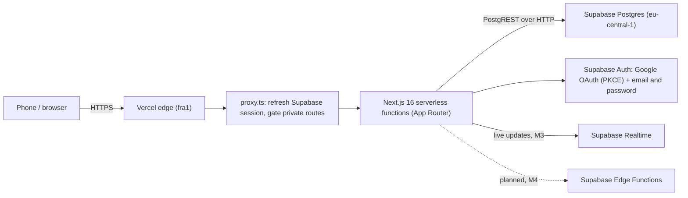
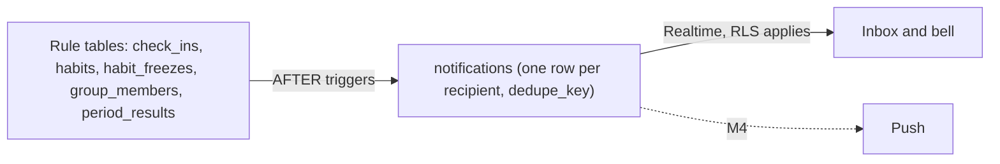

# Keepup architecture

Small family app, small footprint. Serverless end to end: no servers to patch, no load balancer to run, nothing idle to pay for.

## Request path

Every table has row-level security, so the connection PostgREST makes on the app's behalf carries no elevated privilege — a leaked query still can't read another family's data. A pooler (Supavisor) stays a future option if connection count ever becomes the bottleneck; today's traffic doesn't need one.

## Data model (groups and kids)

| Tables | Purpose |
|---|---|
| `profiles` | Adults and children (`kind`). A child has a `group_id` and no `auth.users` row |
| `groups`, `group_members`, `group_invites` | Groups, adult members with roles and join/leave dates, expiring invite links |
| `habits`, `check_ins`, `habit_freezes`, `period_results` | Private and group habits. A group habit has `group_id`; `check_ins.logged_by` is the adult who logged it |
| `group_habit_participants` | Children chosen for a group habit. Adults are never listed |
| `treat_goals` | Kids' goals. Stars and the garden are computed, not stored |
| `notifications`, `nudges`, `cheers` | The feed, and the two ways members nudge each other |
| `dismissed_cards` | Gentle cards on Today that a user closed |

Other people's profiles are never readable; screens get names and avatars from membership-checked `SECURITY DEFINER` functions (decision 0010).

## The feed pipeline

Triggers write the feed, so every path that changes the data (RPC, review, pause, the job that closes periods) produces the same rows (decision 0014). The Inbox reads through an RPC and refreshes from Realtime; push in M4 reads the same rows.

## Environments

| Environment | Trigger | Supabase project | Notes |
|---|---|---|---|
| Local | `supabase start` (Docker) | local Postgres | Dev loop, no network dependency |
| PR preview | PR opened/updated | `keepup-staging` (eu-central-1) | UI-only: the preview app points at the staging database, but a PR's own migrations aren't pushed there. Schema changes are verified by CI (pgTAP against a fresh local database) and only reach staging after the PR merges to `develop` and CI is green |
| `develop` | push, after CI passes | `keepup-staging` (eu-central-1) | `deploy-staging-db.yml` runs on a green `CI` run on `develop` (or manually) and pushes migrations |
| `main` | push | production (M6) | Disabled in `vercel.json` until M6 ships the production pipeline |

Because a PR preview never runs its own migrations against staging, and staging only ever moves forward from merged, CI-checked migrations, schema changes should be written expand-then-contract: add the new column/constraint/table in one migration (additive, safe to deploy under old and new code), ship the code that uses it, then remove what it replaced in a later migration once nothing depends on the old shape.

### Staging auth settings (dashboard)

Configured by hand in the Supabase dashboard for the `keepup-staging` project (not managed by migrations):

- Site URL: `https://keepup-murex.vercel.app`
- Redirect URLs: `https://keepup-murex.vercel.app/auth/callback`, `https://keepup-*-naum4ik-s-org.vercel.app/**`
- Providers: email + password (email confirmation off until an SMTP sender is set up) and Google (the Google OAuth client is in Testing mode)

## Why no load balancer

Vercel's serverless functions are stateless and scale horizontally by request — each invocation is its own process, spun up and torn down by the platform. There's no fleet to balance across because there's no fleet: Vercel's edge network is the load balancer. Running our own (or a Kubernetes cluster in front of one) would add an idle, always-on layer for a workload that's bursty and small — the opposite of what a family habit tracker needs.

## Security layers

| Layer | What it does | Status |
|---|---|---|
| RLS on every table | Row-level security scoped to the authenticated user/family; guarded by a pgTAP test | Live |
| Least privilege | Column-level UPDATE grants on `profiles` (no blanket table grants) | Live |
| Key exposure | No service-role key in the app anywhere — browser and server both use only the publishable key, under RLS. A service-role key will exist only in CI secrets / Edge Functions when a later feature needs it | Live |
| Session verification | Google OAuth uses the PKCE code flow; email + password signs in inside a server action; server checks the session with `getClaims()`, never the unverified `getSession()` | Live |
| Open-redirect protection | `safeNextPath` validates post-auth redirects; unit-tested | Live |
| Input validation | Server actions validate input and give good error messages, but they're not the enforcement boundary: database constraints, RLS, column grants, triggers, and (from M2) `SECURITY DEFINER` RPCs enforce the rules underneath. Server-owned fields (streaks, XP, approvals, timestamps like `onboarded_at`) are written only by the database, never trusted from client input | Live |
| Session response caching | Responses that refresh a Supabase session carry no-cache headers | Live |
| Secrets handling | Secrets live in GitHub/Vercel/Supabase secret stores, never in the repo | Live |
| Supply chain | Lockfile-pinned dependencies (`package-lock.json`, `npm ci`) | Live |
| CI gates | Lint, types, unit, pgTAP, Playwright e2e required by branch protection on `develop` and `main` | Live |
| Data region | EU (Frankfurt) for Postgres and Auth | Live |
| Kids' data minimization | Current schema stores no photos or birthdates; kid profiles keep a nickname, emoji and colour only | Live |
| Encrypted nightly backups | Staging schema, data and logins dumped nightly, encrypted with age, kept 30 days in a private repo; a monthly job restores the latest into a throwaway database and checks it | Live (M3) |
| GDPR export/delete | — | Planned, M6 |

## Scaling path

Starting point: a handful of families, roughly 5 users each. The app servers are stateless and scale horizontally on Vercel automatically — that side of the system doesn't need attention. The database is the bottleneck, and it's addressed in order as load grows, not all at once:

| Growth | What strains first | Response |
|---|---|---|
| ~10x | Nothing yet | The free tier comfortably handles hundreds of active users; PostgREST over HTTP has no per-request connection to pool in the first place |
| ~100x | Hot query paths (today's habits, streak calculations) | Add/tune indexes on those queries |
| ~1000x | Postgres CPU/memory on a single instance | Vertical scaling (bigger paid tier), then read replicas for read-heavy views, moving to paid tiers as usage justifies the cost |

## Deliberately not built

| Not built | Why |
|---|---|
| Kubernetes | No fleet to orchestrate — serverless functions already scale per-request |
| Own load balancer | Vercel's edge network already does this; running one would be an idle layer for a bursty, small workload |
| Microservices | One small app, one team; splitting it now would add network hops and deploy coordination for no present benefit |
| WAF rules | No public attack surface beyond standard auth flows yet; revisit if abuse patterns appear |
| Own rate limiting | Supabase Auth's built-in limits cover login/signup abuse today; feature-specific limits (e.g. the nudge limit) are added with the feature that needs them, not speculatively |
