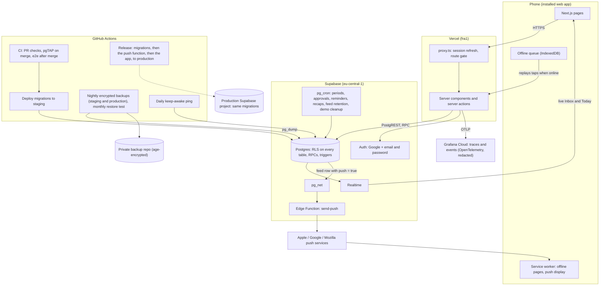
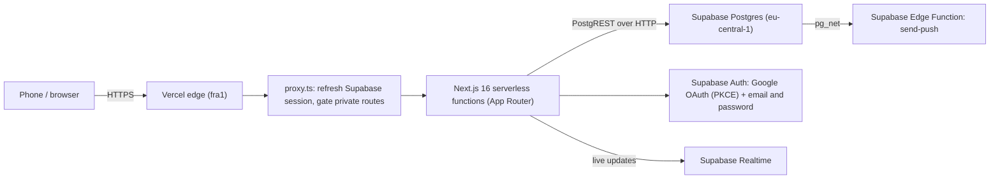
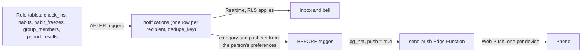
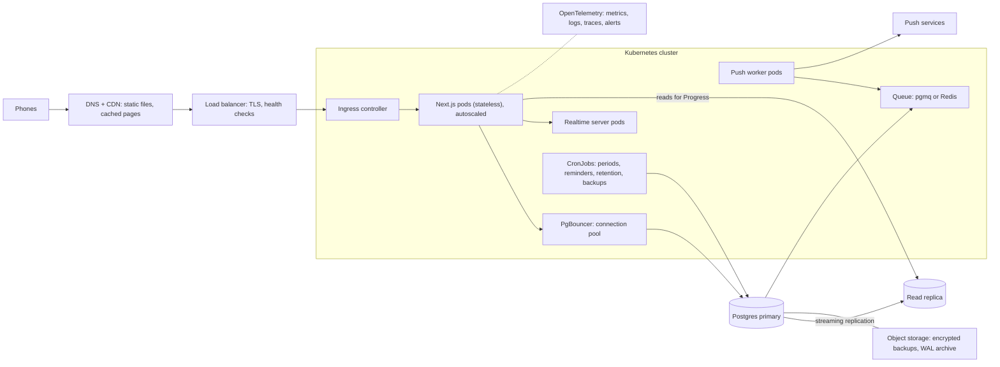

# Keepup architecture

Small family app, small footprint. Serverless end to end: no servers to patch, no load balancer to run, nothing idle to pay for. It runs on free tiers today (see [Free-tier limits](#free-tier-limits)).

## System overview

## Request path

Every table has row-level security, so the connection PostgREST makes on the app's behalf carries no elevated privilege — a leaked query still can't read another family's data. A pooler (Supavisor) stays a future option if connection count ever becomes the bottleneck; today's traffic doesn't need one.

## Data model (groups and kids)

| Tables | Purpose |
|---|---|
| `profiles` | Adults and children (`kind`). A child has a `group_id` and no `auth.users` row |
| `groups`, `group_members`, `group_invites` | Groups, adult members with roles and join/leave dates, expiring invite links |
| `habits`, `check_ins`, `habit_freezes`, `period_results` | Private and group habits. A group habit has `group_id`; `check_ins.logged_by` is the adult who logged it |
| `group_habit_participants` | Children chosen for a group habit. Adults are never listed |
| `treat_goals` | Kids' goals. Stars and the garden are computed, not stored |
| `notifications`, `nudges`, `cheers` | The feed, and the two ways members nudge each other |
| `dismissed_cards` | Gentle cards on Today that a user closed |

Other people's profiles are never readable; screens get names and avatars from membership-checked `SECURITY DEFINER` functions (decision 0010).

## The feed pipeline

Triggers write the feed, so every path that changes the data (RPC, review, pause, the job that closes periods) produces the same rows (decision 0014). The Inbox reads through an RPC and refreshes from Realtime; push reads the same rows, and the database decides whether a row pushes (decision 0016).

## Environments

| Environment | Trigger | Supabase project | Notes |
|---|---|---|---|
| Local | `supabase start` (Docker) | local Postgres | Dev loop, no network dependency |
| PR preview | PR opened/updated | `keepup-staging` (eu-central-1) | UI-only: the preview app points at the staging database, but a PR's own migrations aren't pushed there. Schema changes are verified by CI (pgTAP against a fresh local database, on the merge to `develop`, or before it on a `full-ci` PR) and only reach staging once that run is green |
| `develop` | push, after CI passes | `keepup-staging` (eu-central-1) | `deploy-staging-db.yml` runs on a green `CI` run on `develop` (or manually) and pushes migrations |
| `main` | push (the release PR) | production | `release-please.yml` → `deploy-production`: database migrations and `send-push` first, then the app to the `keepup-prod` Vercel project (https://keepuphabits.vercel.app); a failed step stops the rest. Git auto-deploy for `main` stays off in `vercel.json`. Gated by the repo variable `PRODUCTION_READY` (on since v1.0.0) |

Because a PR preview never runs its own migrations against staging, and staging only ever moves forward from merged, CI-checked migrations, schema changes should be written expand-then-contract: add the new column/constraint/table in one migration (additive, safe to deploy under old and new code), ship the code that uses it, then remove what it replaced in a later migration once nothing depends on the old shape.

### Staging auth settings (dashboard)

Configured by hand in the Supabase dashboard for the `keepup-staging` project (not managed by migrations):

- Site URL: `https://keepup-stage.vercel.app`
- Redirect URLs: `https://keepup-stage.vercel.app/auth/callback`, `https://keepup-*-naum4ik-s-org.vercel.app/**`
- Providers: email + password and Google (the Google OAuth client is in Testing mode)
- Emails (confirm address, reset password): Keepup's templates in `supabase/templates/`, sent through a Gmail SMTP sender set in the dashboard; their links land on `/auth/confirm` with a `token_hash`

## Why no load balancer

Vercel's serverless functions are stateless and scale horizontally by request — each invocation is its own process, spun up and torn down by the platform. There's no fleet to balance across because there's no fleet: Vercel's edge network is the load balancer. Running our own (or a Kubernetes cluster in front of one) would add an idle, always-on layer for a workload that's bursty and small — the opposite of what a family habit tracker needs.

## Security layers

| Layer | What it does | Status |
|---|---|---|
| RLS on every table | Row-level security scoped to the authenticated user/family; guarded by a pgTAP test | Live |
| Least privilege | Column-level UPDATE grants on `profiles` (no blanket table grants) | Live |
| Key exposure | No service-role key in the app anywhere — browser and server both use only the publishable key, under RLS. The service-role key exists only in the `send-push` Edge Function's secrets and in CI | Live |
| Session verification | Google OAuth uses the PKCE code flow; email + password signs in inside a server action; server checks the session with `getClaims()`, never the unverified `getSession()` | Live |
| Open-redirect protection | `safeNextPath` validates post-auth redirects; unit-tested | Live |
| Input validation | Server actions validate input and give good error messages, but they're not the enforcement boundary: database constraints, RLS, column grants, triggers, and (from M2) `SECURITY DEFINER` RPCs enforce the rules underneath. Server-owned fields (streaks, XP, approvals, timestamps like `onboarded_at`) are written only by the database, never trusted from client input | Live |
| Session response caching | Responses that refresh a Supabase session carry no-cache headers | Live |
| Secrets handling | Secrets live in GitHub/Vercel/Supabase secret stores, never in the repo | Live |
| Supply chain | Lockfile-pinned dependencies (`package-lock.json`, `npm ci`) | Live |
| CI gates | Every PR: lint, types, unit and Edge Function tests (~1 min, required) and one sanity e2e test (~3 min, not required). Every merge: pgTAP, gating the staging deploy, and the full Playwright suite after it. `full-ci` PRs: everything before the merge (decision 0024) | Live |
| Data region | EU (Frankfurt) for Postgres and Auth | Live |
| Kids' data minimization | Current schema stores no photos or birthdates; kid profiles keep a nickname, emoji and colour only | Live |
| Encrypted nightly backups | Schema, data and logins dumped nightly, encrypted with age, kept 30 days in a private repo; a monthly job restores the latest into a throwaway database and checks it. Staging since M3, production (`backup-production.yml`, and a production leg in the restore test) since v1.0.0 | Live |
| GDPR export/delete | Settings → Your data: Export my data (one JSON file from `export_my_data()`) and Delete account (`delete_my_account()`, one transaction, decision 0025); both covered by pgTAP | Live (M6) |
| Telemetry redaction | Passwords, tokens, cookies and keys are masked in spans and events before export to Grafana Cloud; a unit test fails if one gets through ([observability](observability/README.md)) | Live (M6) |

## Free-tier limits

Keepup runs on free tiers. These are the limits that matter, from the providers' docs (checked 2026-10-06; they change):

| Service | Limit (free) | Keepup today | Hit first when |
|---|---|---|---|
| Supabase database | 500 MB, shared CPU, 500 MB RAM | A few MB | Tens of thousands of check-ins and feed rows; `keepup-feed-retention` trims old feed rows nightly |
| Supabase Realtime | **200 concurrent connections**, 2M messages a month | A handful | **About 200 people with the app open at the same moment.** The first real ceiling |
| Supabase egress | 5 GB a month (+ 5 GB cached) | Small | Thousands of active users opening Today often |
| Supabase Auth | 50,000 monthly active users | A family | Not soon |
| Supabase Edge Functions | 500,000 invocations a month | One per push | Hundreds of thousands of pushes a month |
| Supabase backups | None on free | Our own: nightly `pg_dump`, age-encrypted, kept 30 days, restore-tested monthly | — |
| Supabase pausing | Paused after a week without activity; restorable for 90 days | Daily use, the nightly backup and the `keepalive.yml` ping all count as activity | Never, while the workflows run |
| Supabase logs | 1 day (API, database), 1 hour (auth audit) | Enough to debug the same day | — |
| Vercel Hobby | Non-commercial use only (asking for donations is allowed); 1M function invocations, 4 h active CPU, 100 GB data transfer a month; 100 deployments a day; 1 build at a time; runtime logs kept 1 hour | Small | Any payment, ads or paid feature means Vercel Pro |
| GitHub Actions | Free for public repositories; scheduled workflows switch off after 60 days without a commit | CI, backups, restore test, keep-awake | `keepalive.yml` re-enables the schedules daily |
| Google sign-in | The OAuth client is in Testing mode: only listed test users (up to 100) | The family | Before strangers join: publish the OAuth consent screen |
| Email | Supabase's built-in mail only reaches the team, so sign-in emails go through a Gmail SMTP sender | Confirm and reset emails | Gmail's daily sending limit, if many people sign up at once |
| Web Push | Free (Apple, Google and Mozilla push services) | One subscription per device | — |

## Scaling path

Starting point: a handful of families, roughly 5 users each. The app servers are stateless and scale horizontally on Vercel automatically. Postgres and Realtime are what strain, and each step is taken only when measurements show it's needed, not all at once:

| Stage | Roughly | What strains first | Response |
|---|---|---|---|
| Today | < 50 users | Nothing | Free tiers |
| 1 | ~500 users | Realtime connections at busy moments (evenings); hot queries (Today, streaks) | Tune indexes on the hot paths; subscribe to Realtime only on screens that need it (the Inbox, a group habit open on screen) |
| 2 | ~5,000 users | Database size and CPU; egress; push bursts at reminder time | Supabase Pro (8 GB disk, daily backups, larger compute), Vercel Pro; spread reminders across the quarter hour; cache read-only data (templates) at the edge |
| 3 | ~50,000 users | One Postgres doing everything; connections from Edge Functions | Supavisor pooling for direct connections; a read replica for Progress and the calendar; a queue (pgmq) between feed rows and `send-push`, so pushes go out in batches with retries |
| 4 | Beyond | Single-region latency; the largest tables | Partition `check_ins` and `notifications` by month; a second region for reads; move heavy analytics off the primary |

## If we had to run it ourselves

Not the plan: it would add servers to patch, an always-on load balancer, and cost. But this is the shape it would take, for example to leave Vercel and Supabase, or to run the stack on Kubernetes:

| Piece | Replaces | Why it's needed when self-hosting |
|---|---|---|
| Load balancer + ingress | Vercel's edge | Spreads requests over app pods, ends TLS, takes unhealthy pods out of rotation |
| Autoscaled app pods | Vercel functions | The app is stateless, so pods can be added or removed freely |
| PgBouncer | PostgREST's HTTP model | Many pods with many connections would exhaust Postgres; the pool caps them |
| Primary + read replica | Supabase Postgres | Writes on one, heavy reads (Progress, calendar) on the other; a failover target |
| Queue + push workers | pg_net + the Edge Function | Retries, batching and back-pressure for push bursts |
| CronJobs | pg_cron + GitHub Actions schedules | Scheduled work inside the cluster |
| Object storage + WAL archive | The nightly dump | Point-in-time recovery, not just last night's copy |
| OpenTelemetry stack | The providers' dashboards | Nobody else watches the servers any more |

## Deliberately not built

| Not built | Why |
|---|---|
| Kubernetes | No fleet to orchestrate — serverless functions already scale per-request |
| Own load balancer | Vercel's edge network already does this; running one would be an idle layer for a bursty, small workload |
| Microservices | One small app, one team; splitting it now would add network hops and deploy coordination for no present benefit |
| WAF rules | No public attack surface beyond standard auth flows yet; revisit if abuse patterns appear |
| Own rate limiting | Supabase Auth's built-in limits cover login/signup abuse today; feature-specific limits (e.g. the nudge limit) are added with the feature that needs them, not speculatively |
