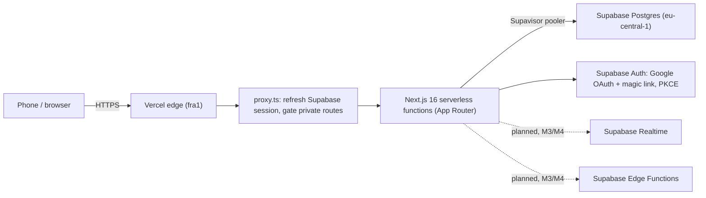

# Keepup architecture

Small family app, small footprint. Serverless end to end: no servers to patch, no load balancer to run, nothing idle to pay for.

## Request path

Every table has row-level security, so the pooler connection carries no elevated privilege — a leaked query still can't read another family's data.

## Environments

| Environment | Trigger | Supabase project | Notes |
|---|---|---|---|
| Local | `supabase start` (Docker) | local Postgres | Dev loop, no network dependency |
| PR preview + `develop` | push / PR | `keepup-staging` (eu-central-1) | Auto-deployed; migrations pushed by `deploy-staging-db.yml` |
| `main` | push | production (M6) | Disabled in `vercel.json` until M6 ships the production pipeline |

## Why no load balancer

Vercel's serverless functions are stateless and scale horizontally by request — each invocation is its own process, spun up and torn down by the platform. There's no fleet to balance across because there's no fleet: Vercel's edge network is the load balancer. Running our own (or a Kubernetes cluster in front of one) would add an idle, always-on layer for a workload that's bursty and small — the opposite of what a family habit tracker needs.

## Security layers

| Layer | What it does | Status |
|---|---|---|
| RLS on every table | Row-level security scoped to the authenticated user/family; guarded by a pgTAP test | Live |
| Least privilege | Column-level UPDATE grants on `profiles` (no blanket table grants) | Live |
| Key exposure | No service-role key in the app anywhere — browser and server both use only the publishable key, under RLS. A service-role key will exist only in CI secrets / Edge Functions when a later feature needs it | Live |
| Session verification | Google OAuth and magic link both use the PKCE code flow; server checks the session with `getClaims()`, never the unverified `getSession()` | Live |
| Open-redirect protection | `safeNextPath` validates post-auth redirects; unit-tested | Live |
| Input validation | Every server action validates input server-side, not just in the client form | Live |
| Session response caching | Responses that refresh a Supabase session carry no-cache headers | Live |
| Secrets handling | Secrets live in GitHub/Vercel/Supabase secret stores, never in the repo | Live |
| Supply chain | Pinned dependencies + committed lockfile | Live |
| CI gates | Lint, types, unit, pgTAP, Playwright e2e required by branch protection on `develop` and `main` | Live |
| Data region | EU (Frankfurt) for Postgres and Auth | Live |
| Kids' data minimization | Current schema stores no photos or birthdates; kid profiles (M3) will keep nickname-only | Live / Planned, M3 |
| Encrypted nightly backups | — | Planned, M3 |
| GDPR export/delete | — | Planned, M6 |

## Scaling path

Starting point: a handful of families, roughly 5 users each. The app servers are stateless and scale horizontally on Vercel automatically — that side of the system doesn't need attention. The database is the bottleneck, and it's addressed in order as load grows, not all at once:

| Growth | What strains first | Response |
|---|---|---|
| ~10x | Nothing yet | The free tier comfortably handles hundreds of active users; Supavisor pooling already absorbs connection churn from serverless functions |
| ~100x | Hot query paths (today's habits, streak calculations) | Add/tune indexes on those queries |
| ~1000x | Postgres CPU/memory on a single instance | Vertical scaling (bigger paid tier), then read replicas for read-heavy views, moving to paid tiers as usage justifies the cost |

## Deliberately not built

| Not built | Why |
|---|---|
| Kubernetes | No fleet to orchestrate — serverless functions already scale per-request |
| Own load balancer | Vercel's edge network already does this; running one would be an idle layer for a bursty, small workload |
| Microservices | One small app, one team; splitting it now would add network hops and deploy coordination for no present benefit |
| WAF rules | No public attack surface beyond standard auth flows yet; revisit if abuse patterns appear |
| Own rate limiting | Supabase Auth's built-in limits cover login/signup abuse today; feature-specific limits (e.g. the nudge limit) are added with the feature that needs them, not speculatively |
