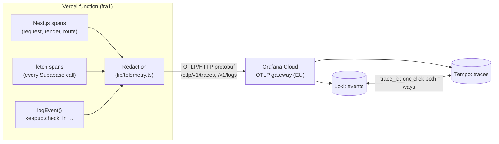

# Observability

Keepup on Vercel sends traces and events to **Grafana Cloud** (free tier) over **OpenTelemetry**. No collector, no agent, no paid plan: the app exports OTLP straight to Grafana's gateway, and switching vendors means changing two environment variables.



## What is sent
- **Traces** for every request, server action, render and Supabase call (`@vercel/otel` traces `fetch`, which supabase-js uses). Each trace carries `user.id` and `user.email` (from the session's JWT claims, no extra query); check-in taps add `habit.id` and `child.id`.
- **Events** (OpenTelemetry logs): one wide event per meaningful action, with the trace it happened in. Today: `keepup.check_in` with who, which habit (title, category), for which child, the outcome (`saved`, `refused` with the rule's code, `failed` with the error) and the XP. The habit and child names are read **after the response** (`after()`), so a tap never waits for its telemetry.
- **Labels:** `service.name=keepup`, `deployment.environment.name` = `staging`, `preview` or `local` (`OTEL_RESOURCE_ATTRIBUTES`; Vercel's own "production" is staging until v1).

Events, not clicks: a click says what was pressed; an event says what happened and whether it worked. Browser telemetry (page views, JS errors, Web Vitals) comes later through Grafana Faro.

## What is never sent
Secrets: the sign-in `code`, `token` / `access_token` / `refresh_token` parameters, `authorization` / `cookie` / `apikey` values, JWTs, Grafana (`glc_`) and Supabase (`sb_secret_`) keys. `lib/telemetry.ts` masks them in span names, attributes, events and log records **before export**, and `lib/telemetry.test.ts` fails if any of them gets through. CI runs it on every PR.

## Design notes (and the traps behind them)
- **One explicit export path, never `"auto"`.** With `OTEL_EXPORTER_OTLP_ENDPOINT` set, `@vercel/otel` adds its own exporter even when you pass a custom one, so every span went out twice: once redacted, once not. Found by counting requests on a local OTLP server, not by reading the config.
- **Flush logs yourself.** `@vercel/otel` flushes spans when a request ends, not logs; a frozen function would drop them. `flushLogs()` runs at the end of each `after()` callback.
- **No endpoint, no export.** Dev and CI send nothing (no retry noise to `localhost:4318`).
- **Sampling:** 100%. At family scale the free tier (50 GB of traces and 50 GB of logs a month, 14-day retention) is out of reach; `OTEL_TRACES_SAMPLER_ARG` lowers it without a deploy of new code.

## Incident: the silent 404 (2026-10-07)
After the tracing PR merged, staging sent nothing, while local dev worked.
1. Deploy confirmed; no traces under any label (only `local`).
2. The OTel SDK's own warning ("Inconsistent start and end time") in Vercel's logs proved the SDK ran on Vercel, so spans were made and lost on the way out.
3. `OTEL_LOG_LEVEL=debug` + redeploy: `@vercel/otel/otlp: onSuccess 404 Not Found`. A routing error, **reported as success**.
4. The endpoint variable was re-entered as `https://otlp-gateway-prod-eu-west-2.grafana.net/otlp`, redeployed: `200 OK`, traces arrived.

Lessons: `@vercel/otel` 2.1.3 reports 401 and 404 as success, so an app can't notice its telemetry is gone. An alert on **"no traces from staging for 30 minutes"** watches the pipeline from the other end. Environment variable edits only reach a deployment built after them.

## Queries
TraceQL (Tempo):
```
{ resource.deployment.environment.name = "staging" && span.user.email = "anna@example.com" }
{ resource.service.name = "keepup" && name =~ ".*check-ins/tap.*" }
```
LogQL (Loki; attribute dots become underscores):
```
{service_name="keepup"} | event_name="keepup.check_in" | check_in_outcome="refused"
sum by (habit_title) (count_over_time({service_name="keepup"} | event_name="keepup.check_in" [1h]))
```
From a trace to the database: `user.id` is `auth.users.id` and `profiles.id`; `habit.id` is `habits.id`.

## Configuration (Vercel)
| Variable | Value |
|---|---|
| `OTEL_EXPORTER_OTLP_ENDPOINT` | `https://otlp-gateway-<region>.grafana.net/otlp` (no trailing slash, no `/v1/traces`) |
| `OTEL_EXPORTER_OTLP_HEADERS` | `Authorization=Basic%20<base64(instanceId:token)>`, Sensitive |
| `OTEL_RESOURCE_ATTRIBUTES` | `deployment.environment.name=staging` (Production), `=preview` (Preview) |
| `OTEL_LOG_LEVEL` | `warn`; `debug` to see export results |
